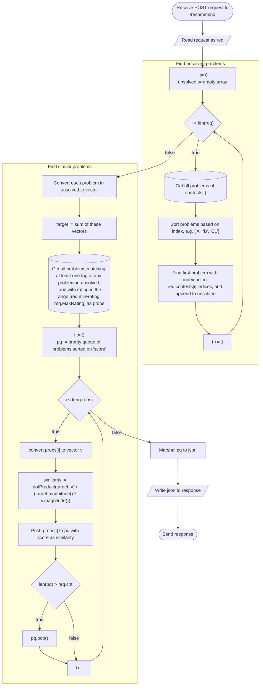

# Endpoint: POST /recommend
This endpoint is for recommending Codeforces problems similar to
problems the user has struggled with in earlier contests.

## Specification
### Request
| Property     | Type      | Description |
|--------------|-----------|-------------|
|`count`       |`Integer`   |Amount of problems to recommend. Must be in the range [0, 10].|
|`minRating`   |`Integer`   |Minimum rating of recommended problems.|
|`maxRating`   |`Integer`   |Maximum rating of recommended problems.|
|`lookback`    |`Integer`   |How many recent contests to consider when making recommendations.|
|`submissions` |`Submission`|All accepted submissions the user has ever made.|

### Response
| Property     | Type      | Description |
|--------------|-----------|-------------|
|`[].score`    |`Float`    |The similarity of the problem to the unsolved problems. Between -1 and 1.|
|`[].problem`  |`Problem`  |The recommended problem.|

## Flowchart

